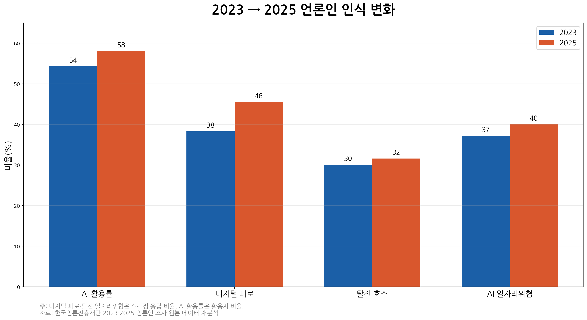
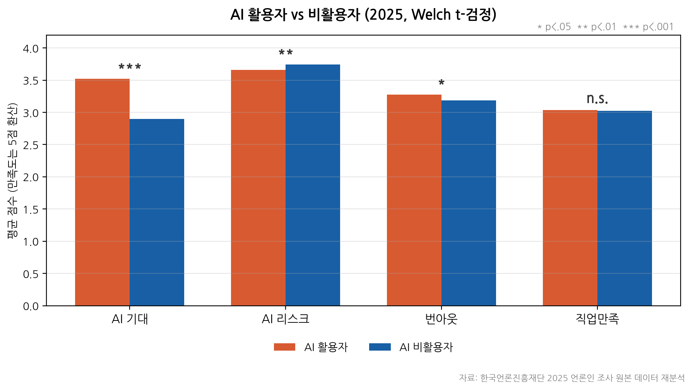
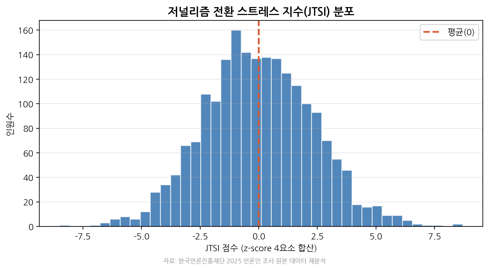
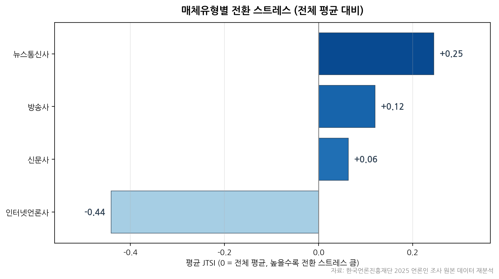

# 기자들은 AI를 믿는가, 견디는가?

### 2023·2025 언론인 조사로 본 생성형 AI 시대 저널리즘 전환 스트레스

> 한국언론진흥재단 「언론 통계 분석·활용 경진대회」 출품 프로젝트

---

## 1. 프로젝트 개요

생성형 AI는 뉴스 생산 현장에 빠르게 도입되고 있다. 기존 논의가 주로 뉴스 소비자의 AI 수용 태도에 초점을 맞췄다면, 본 프로젝트는 시선을 뉴스 생산자인 **언론인**에게 둔다.

본 분석은 한국언론진흥재단의 2023·2025 「언론인 조사」 원본 데이터를 활용하여, 생성형 AI 확산 이후 언론인의 AI 활용, 디지털 피로, 직업 만족도, 번아웃, 전환 스트레스 변화를 분석한다.

분석의 핵심은 단순히 “AI를 얼마나 쓰는가”가 아니라, **AI 활용 증가와 함께 언론인의 전환 부담이 어떻게 변화하고 있는가**를 확인하는 것이다.

---

## 2. 핵심 발견

### 1) AI 활용보다 디지털 피로가 더 빠르게 증가

AI 활용률은 2023년 54.3%에서 2025년 58.1%로 **+3.8%p** 증가했다.
같은 기간 디지털 피로는 38.3%에서 45.5%로 **+7.2%p** 증가했다.

즉, AI 활용은 늘었지만 디지털 전환 과정에서 언론인이 느끼는 피로는 더 빠른 속도로 증가했다.

### 2) AI 활용자는 기대효과를 크게 보지만, 번아웃 관리도 필요

2025년 기준 AI 활용자는 비활용자보다 AI 기대효과를 뚜렷하게 높게 평가했다.

| 지표     | AI 활용자 | AI 비활용자 | 해석                   |
| ------ | -----: | ------: | -------------------- |
| AI 기대  |   3.52 |    2.90 | 활용자가 크게 높음           |
| AI 리스크 |   3.66 |    3.74 | 비활용자가 약간 높으나 효과크기 작음 |
| 번아웃    |   3.27 |    3.19 | 활용자가 약간 높으나 효과크기 작음  |
| 직업 만족도 |   6.07 |    6.05 | 유의한 차이 없음            |

AI 활용자는 AI의 효능을 크게 인식하지만, 동시에 번아웃 관리 필요성도 관찰된다. 다만 번아웃 차이는 효과크기가 작기 때문에 강한 집단 차이로 해석하기보다는, AI 활용 집단에서도 업무 부담 관리가 필요하다는 수준으로 해석한다.

### 3) 고위험 집단은 두 유형으로 나뉨

AI 활용 여부와 디지털 피로를 기준으로 2025년 언론인을 2×2 유형으로 분류했다.

| 구분     | 디지털 피로 낮음 | 디지털 피로 높음 |
| ------ | --------- | --------- |
| AI 활용  | 안정 적응형    | AI 과부하형   |
| AI 비활용 | 전환 관망형    | 전환 소외형    |

고위험 집단은 다음 두 유형으로 나타났다.

| 유형      |   인원 |    비율 | 평균 JTSI |
| ------- | ---: | ----: | ------: |
| AI 과부하형 | 549명 | 27.2% |   +1.33 |
| 전환 소외형  | 370명 | 18.3% |   +1.26 |

두 집단은 모두 전환 스트레스가 높지만 원인이 다르다.
AI 과부하형은 AI를 활용하면서도 피로가 높은 집단이고, 전환 소외형은 AI 활용은 낮지만 디지털 피로가 높은 집단이다. 따라서 동일한 교육보다 유형별 지원이 필요하다.

---

## 3. 주요 시각화

### 2023→2025 주요 지표 변화



### AI 활용자와 비활용자 비교



### JTSI 분포



### 매체유형별 JTSI



---

## 4. JTSI — 저널리즘 전환 스트레스 지수

본 프로젝트에서는 언론인의 디지털 전환 부담을 종합적으로 보기 위해 **JTSI(Journalism Transformation Stress Index)**를 구성했다.

JTSI는 다음 네 요소를 z-score로 표준화한 뒤 합산한 복합 지수다.

```text
JTSI = z(디지털 피로) + z(AI 리스크 인식) + z(역할 실행 갭) + z(번아웃)
```

구성 요소는 다음과 같다.

| 구성 요소     | 의미                               |
| --------- | -------------------------------- |
| 디지털 피로    | 디지털 대응과 혁신 과정에서 느끼는 피로감          |
| AI 리스크 인식 | AI 활용으로 발생할 수 있는 위험 인식           |
| 역할 실행 갭   | 중요하다고 생각하는 저널리즘 역할과 실제 실행 수준의 차이 |
| 번아웃       | 업무 탈진과 직업 회의                     |

JTSI는 개인의 심리 상태를 진단하는 임상 지표가 아니라, 집단별 전환 부담을 비교하기 위한 분석 지표다.

---

## 5. 분석 흐름

```text
STEP 1   데이터 로드
STEP 2   변수 매핑
STEP 2.5 공식 통계표 검산
STEP 3   2023→2025 변화 비교
STEP 4   AI 활용자 vs 비활용자 비교
STEP 5   JTSI 설계 및 계산
STEP 5.5 JTSI 민감도 검토
STEP 6   통계적 타당성 확인
STEP 6.5 2×2 위기집단 진단
STEP 7   시각화
STEP 8   정책 제안
STEP 9   최종 보고서 작성
```

자세한 분석 기준과 변수 매핑은 [`SPEC.md`](SPEC.md)에서 확인할 수 있다.

---

## 6. 정책 제안

분석 결과를 바탕으로 다음 세 가지 정책 방향을 제안한다.

| 분석 결과                  | 정책 제안                  |
| ---------------------- | ---------------------- |
| AI 가이드라인 인지율 43.1%     | AI 저널리즘 가이드라인 보급·교육 허브 |
| 고위험군이 과부하형과 소외형으로 구분   | 위기집단 맞춤형 2-트랙 지원       |
| 디지털 피로가 2년 새 +7.2%p 증가 | 디지털 피로·전환 부담 정기 모니터링   |

핵심은 AI 도입 자체를 촉진하는 것에서 끝나는 것이 아니라, 언론인이 AI 전환 과정에서 겪는 부담을 관리하는 방향으로 정책 초점을 확장하는 것이다.

---

## 7. 폴더 구조

```text
journalist-ai-stress/
├── README.md
├── SPEC.md
├── requirements.txt
├── data/
│   ├── raw/
│   └── processed/
├── notebooks/
├── src/
│   ├── variable_mapping.py
│   └── stats_helpers.py
├── outputs/
│   ├── figures/
│   └── tables/
└── report/
```

### 주요 폴더 설명

| 경로                 | 설명                                |
| ------------------ | --------------------------------- |
| `notebooks/`       | 분석 단계별 Jupyter Notebook           |
| `src/`             | 변수 매핑 및 통계검정 보조 코드                |
| `outputs/figures/` | 최종 시각화 이미지                        |
| `outputs/tables/`  | 검산표, 집단 비교표, 통계검정 결과표             |
| `report/`          | 최종 보고서 파일                         |
| `data/raw/`        | 원본 데이터 배치 위치. 원본 파일은 저장소에 포함하지 않음 |

---

## 8. 데이터 출처

한국언론진흥재단 언론통계 자료실
https://www.kpf.or.kr/front/mediaStats/mediaStatsListPage.do

사용 데이터:

* 2023 언론인 조사 원본 데이터
* 2025 언론인 조사 원본 데이터

원본 데이터는 재배포 제한을 고려하여 본 저장소에 포함하지 않는다.
분석 재현을 원하는 경우 한국언론진흥재단 언론통계 자료실에서 원본 데이터를 내려받아 `data/raw/`에 배치해야 한다.

---

## 9. 재현 방법

### 1) 패키지 설치

```bash
pip install -r requirements.txt
```

### 2) 원본 데이터 배치

다음 파일을 `data/raw/`에 배치한다.

```text
data/raw/journalist_2023.sav
data/raw/journalist_2025.sav
```

### 3) 노트북 실행

```bash
jupyter notebook notebooks/
```

노트북은 번호 순서대로 실행한다.

---

## 10. 사용 도구

* Python
* pandas
* numpy
* scipy
* scikit-learn
* pyreadstat
* matplotlib
* Jupyter Notebook

---

## 11. 최종 산출물

| 산출물     | 경로                        |
| ------- | ------------------------- |
| 최종 보고서  | `report/final_report.pdf` |
| 분석 명세서  | `SPEC.md`                 |
| 시각화 이미지 | `outputs/figures/`        |
| 결과표     | `outputs/tables/`         |
| 분석 노트북  | `notebooks/`              |
